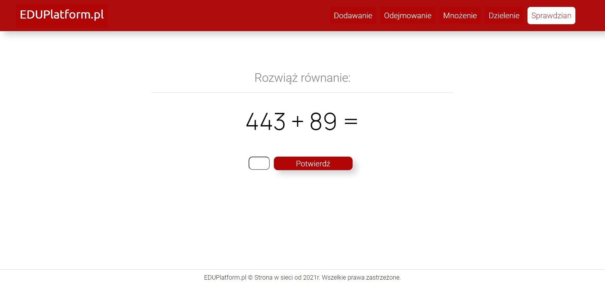

# Education Platfrom

## General info
#### Education platform for primary school students.

Helps to learn how to:
- addition
- subtraction
- multiplication
- division

After studying, you can take one of the exams
## How to use

### Studying:
After choosing what do you want to study programme will display fully random equations which you should solve.

If your answer will be wrong the programme will display a message "Błąd, spróbuj ponownie"

### Exam:
You can choose from 5 exams:
- addition
- subtraction
- multiplication
- division
- mix

Exam has 10 questions for each one you can get 1 point.

After exam you will see how many point did you get, what is your mark and all 10 equations with your answers.
Correct answers will be colored green and wrong answers will be red.

## Technologies
- HTML
- CSS
- JavaScript
## Version
1.0
